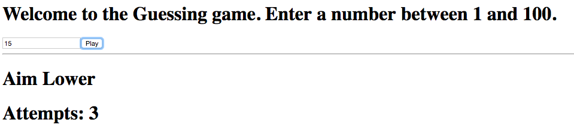

= Lab 01

[abstract]
In this lab you'll implement a guessing game(!!!) using React. The objective is to get comfortable with state and data binding.

== Application
Have a look at the screenshot below. +

* Create Lab01.html
* Implement a guessing game. 
* Your application will generate a random number between 1 and 100.
* User will play the game till he guesses the number correct.

* Given below are some screenshots
* image:01.png[]
* image:02.png[]
* image:03.png[]
* 
* image:05.png[]

* When you guess the number correct, display a message "You've got it!!!"
* If the user enters an invalid input, display an error message (Invalid Input) in red
* Don't worry too much about the look and feel of the page
* Don't give up.
