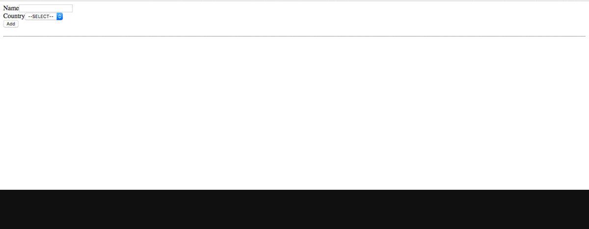

* Create a React app, say __wednesday-app__ using __create-react-app__ tool
* Implement as shown below

* You'll have atleast two components. 
* One for input and other one for display
* Design the state and implement

* __Please discuss with your neighbour and implement the lab__

 